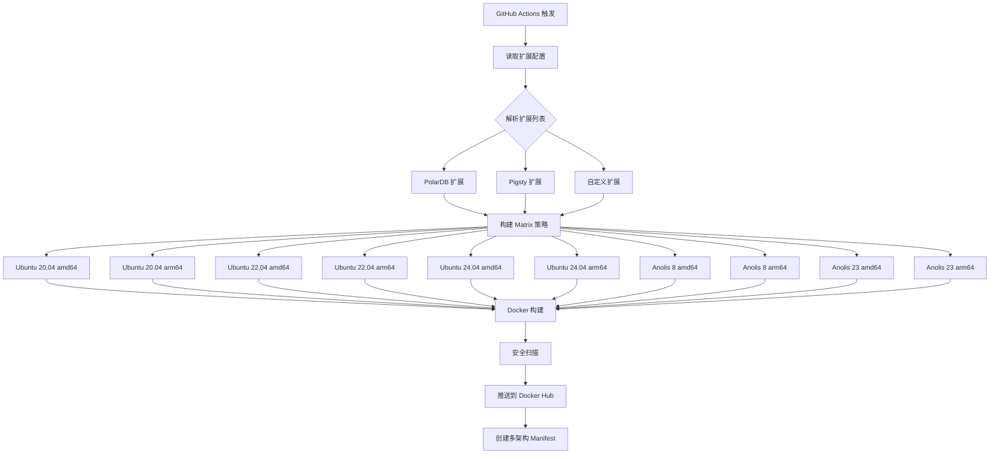
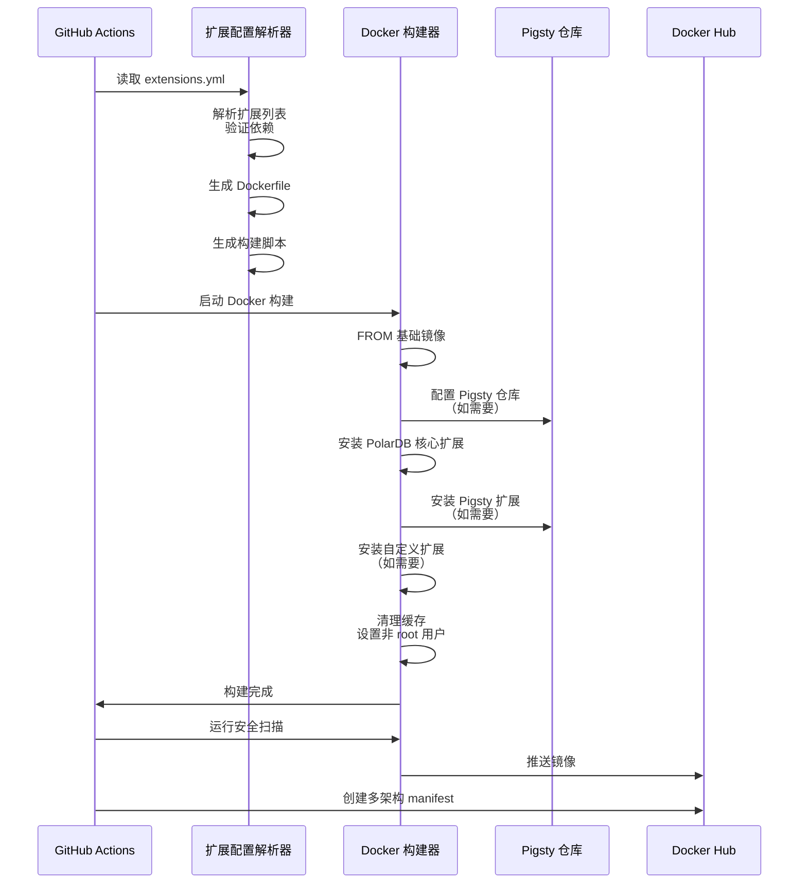

# 设计文档

## 概述

本设计描述了一个灵活的 Docker 镜像构建流水线，通过 YAML 配置文件实现自定义扩展选择。系统采用模块化设计，将扩展安装、OS 特定配置和构建编排分离，支持 PolarDB 内置扩展、Pigsty 扩展仓库（440+ 扩展）以及自定义扩展源。

**核心设计原则：**
- 声明式配置：所有扩展通过 `docker/extensions.yml` 配置
- 模块化架构：OS 特定逻辑与通用逻辑分离
- 构建缓存优化：利用 Docker 层缓存和包管理器缓存
- 多架构并行：同时构建 amd64 和 arm64 镜像
- 安全优先：凭证隔离、镜像扫描、非 root 运行

## 架构

### 整体架构图



### 构建流程



## 组件设计

### 组件 1: 扩展配置系统

**文件位置**: `docker/extensions.yml` + `docker/scripts/parse-extensions.py`

**职责**:
- 解析扩展配置 YAML 文件
- 验证扩展依赖关系
- 生成 OS 特定的安装脚本
- 处理扩展冲突检测

**接口**:
```yaml
# 输入：docker/extensions.yml
extension_sets:
  polar_core:
    - polar_audit
    - polar_monitor
  spatial:
    - postgis
    - pgrouting
  pigsty:
    - pgvector
    - timescaledb

default_sets: [polar_core, spatial]
os_overrides:
  ubuntu24.04:
    additional_extensions: [custom_ext]
  anolis8:
    exclude_extensions: [ext_unavailable_on_rhel]
```

**输出**:
- OS 特定的扩展安装脚本
- 扩展元数据 JSON（用于镜像标签）

**依赖**:
- PyYAML（Python 库）
- 扩展知识库（已知扩展的元数据）

**重用**:
- 复用 `external/Makefile` 中的扩展列表
- 复用 `package/` 目录中的依赖解析逻辑

### 组件 2: Dockerfile 生成器

**文件位置**: `docker/scripts/generate-dockerfile.sh`

**职责**:
- 根据解析的扩展列表生成 Dockerfile
- 处理 OS 特定差异（Ubuntu vs Anolis）
- 优化 Docker 层缓存
- 注入构建参数和元数据

**架构**:
```bash
generate-dockerfile.sh
├── templates/
│   ├── Dockerfile.ubuntu.tmpl
│   └── Dockerfile.anolis.tmpl
├── installers/
│   ├── install-polar-extensions.sh
│   ├── install-pigsty-extensions.sh
│   └── install-custom-extensions.sh
└── common/
    └── base-config.sh
```

**模板示例** (Dockerfile.ubuntu.tmpl):
```dockerfile
ARG UBUNTU_VERSION=${UBUNTU_VERSION}
FROM ubuntu:${UBUNTU_VERSION} AS builder

# 构建参数
ARG PG_MAJOR=15
ARG EXTENSIONS_LIST

# 安装构建依赖
RUN apt-get update && apt-get install -y \
    build-essential \
    # ... 其他依赖

# 复制 PolarDB 源码
COPY . /build/polardb

# 配置和构建 PolarDB
RUN cd /build/polardb && \
    ./configure --prefix=/usr/local/polardb && \
    make -j$(nproc) && \
    make install

# 安装扩展（注入生成的脚本）
COPY docker/scripts/generated/install-extensions-${UBUNTU_VERSION}.sh /tmp/
RUN /tmp/install-extensions-${UBUNTU_VERSION}.sh && \
    rm /tmp/install-extensions-${UBUNTU_VERSION}.sh

# 运行时镜像
FROM ubuntu:${UBUNTU_VERSION}
COPY --from=builder /usr/local/polardb /usr/local/polardb
# ... 其他运行时配置
```

### 组件 3: GitHub Actions Workflow

**文件位置**: `.github/workflows/docker-build.yml`

**职责**:
- 定义构建矩阵（OS × 架构）
- 配置 Docker Hub 认证
- 触发并行构建
- 创建多架构 manifest
- 运行安全扫描

**Matrix 策略**:
```yaml
strategy:
  matrix:
    os: [ubuntu20.04, ubuntu22.04, ubuntu24.04, anolis8, anolis23]
    arch: [amd64, arm64]
    exclude:
      # 排除不支持的组合
      - os: anolis8
        arch: arm64  # 如果 Anolis 8 不支持 arm64
  fail-fast: false
```

**关键步骤**:
1. **配置解析**: 运行 `parse-extensions.py` 生成安装脚本
2. **Docker 构建**: 使用 `docker buildx` 支持多架构
3. **安全扫描**: 集成 Trivy 或 Docker Scout
4. **推送镜像**: 推送到用户 Docker Hub
5. **创建 Manifest**: 使用 `docker manifest create` 合并多架构

### 组件 4: Pigsty 集成模块

**文件位置**: `docker/scripts/install-pigsty.sh`

**职责**:
- 配置 Pigsty 包仓库
- 使用 `pig` 包管理器安装扩展
- 处理 Pigsty 特定的依赖
- 回退到源码构建（如需要）

**实现**:
```bash
#!/bin/bash
# 配置 Pigsty 仓库
if [ "$OS_FAMILY" = "debian" ]; then
  curl -fsSL https://repo.pigsty.io/apt | bash
  apt-get install -y pig
else
  curl -fsSL https://repo.pigsty.io/yum | bash
  yum install -y pig
fi

# 安装扩展
for ext in "$PIGSTY_EXTENSIONS"; do
  pig install "$ext" || {
    echo "警告: 无法从 Pigsty 安装 $ext，尝试源码构建"
    # 回退逻辑
  }
done
```

**依赖**:
- Pigsty 仓库可用性
- `pig` 包管理器
- OS 包管理器（apt/yum）

### 组件 5: 多架构构建支持

**文件位置**: `.github/workflows/docker-build.yml` (buildx 配置)

**职责**:
- 配置 QEMU 模拟器（用于跨架构构建）
- 管理 Docker buildx 构建器
- 并行构建多架构镜像

**实现**:
```yaml
- name: Set up QEMU
  uses: docker/setup-qemu-action@v3

- name: Set up Docker Buildx
  uses: docker/setup-buildx-action@v3
  with:
    platforms: linux/amd64,linux/arm64

- name: Build and push
  uses: docker/build-push-action@v5
  with:
    context: .
    platforms: linux/amd64,linux/arm64
    push: true
    tags: |
      ${{ secrets.DOCKERHUB_USERNAME }}/polardb:${{ github.ref_name }}-ubuntu24.04
      ${{ secrets.DOCKERHUB_USERNAME }}/polardb:latest-ubuntu24.04
    labels: |
      org.opencontainers.image.title=PolarDB with Extensions
      org.opencontainers.image.description=PolarDB ${EXTENSIONS_LIST}
      org.opencontainers.image.revision=${{ github.sha }}
```

## 数据模型

### 扩展配置模型

```yaml
# docker/extensions.yml
extension_sets:
  # 扩展集合定义
  <set_name>:
    - <extension_name>
    - <extension_name>

# 默认构建的扩展集合
default_sets: [<set1>, <set2>]

# OS 特定覆盖
os_overrides:
  <os_version>:
    additional_extensions: [<ext1>, <ext2>]
    exclude_extensions: [<ext3>]

# 扩展源配置（可选）
extension_sources:
  pigsty:
    enabled: true
    repo_url: https://repo.pigsty.io
  custom:
    - name: my_extension
      type: git
      url: https://github.com/user/ext.git
      branch: main
```

### 扩展元数据模型

```json
// 扩展知识库 (docker/scripts/extension-metadata.json)
{
  "extension_name": {
    "category": "polar|pigsty|spatial|custom",
    "dependencies": ["ext1", "ext2"],
    "os_support": {
      "ubuntu": ["20.04", "22.04", "24.04"],
      "anolis": ["8", "23"]
    },
    "package_name": {
      "ubuntu": "postgresql-15-ext",
      "anolis": "postgresql15-ext"
    },
    "build_from_source": false,
    "min_pg_version": "15",
    "max_pg_version": "17"
  }
}
```

## 错误处理

### 错误场景

1. **扩展配置无效**
   - **处理**: 在构建前验证 YAML 语法和扩展名称
   - **用户影响**: 构建立即失败，显示配置错误和修复建议

2. **扩展依赖冲突**
   - **处理**: 检测循环依赖和版本冲突
   - **用户影响**: 警告信息，建议移除冲突扩展

3. **扩展不可用**
   - **处理**: 尝试 Pigsty 仓库，失败后尝试源码构建
   - **用户影响**: 记录警告，继续构建其他扩展

4. **OS/架构不支持**
   - **处理**: 跳过该组合，继续构建其他
   - **用户影响**: 构建日志中记录跳过原因

5. **Docker Hub 认证失败**
   - **处理**: 在构建前验证凭证
   - **用户影响**: 构建失败，提示配置 GitHub Secrets

6. **构建超时**
   - **处理**: 设置合理的超时限制（45分钟）
   - **用户影响**: 失败后建议减少扩展数量或使用缓存

7. **安全扫描发现漏洞**
   - **处理**: 记录漏洞，但不阻止推送（可配置）
   - **用户影响**: 镜像标签包含安全警告

## 测试策略

### 单元测试

**扩展配置解析器测试**:
- 测试有效的 YAML 解析
- 测试无效的 YAML 错误处理
- 测试扩展依赖解析
- 测试 OS 特定覆盖逻辑
- 测试扩展冲突检测

**Dockerfile 生成器测试**:
- 测试生成的 Dockerfile 语法正确性
- 测试 Ubuntu 和 Anolis 模板差异
- 测试构建参数注入
- 测试优化指令正确性

### 集成测试

**端到端构建测试**:
- 使用最小扩展集构建镜像
- 使用典型扩展集构建镜像
- 验证生成的镜像可以启动
- 验证扩展正确安装（`SELECT * FROM pg_available_extensions;`）

**多架构测试**:
- 在 amd64 和 arm64 runner 上构建
- 验证多架构 manifest 创建正确
- 测试在不同架构上拉取镜像

**Pigsty 集成测试**:
- 测试 Pigsty 仓库配置
- 测试 `pig` 包管理器安装
- 测试回退到源码构建逻辑

### 镜像验证测试

**功能测试**:
```bash
# 测试 PolarDB 核心
docker run --rm polardb:latest psql --version

# 测试扩展加载
docker run --rm polardb:latest psql -c "CREATE EXTENSION postgis;"
docker run --rm polardb:latest psql -c "CREATE EXTENSION pgvector;"

# 测试健康检查
docker run --rm polardb:latest pg_isready
```

**安全测试**:
```bash
# 使用 Trivy 扫描
trivy image polardb:latest

# 检查非 root 用户
docker inspect polardb:latest | grep User

# 检查敏感文件
docker run --rm polardb:latest ls -la /root
```

**性能测试**:
- 镜像大小验证（典型扩展集 < 2GB）
- 构建时间验证（单镜像 < 45 分钟）
- 启动时间验证（< 30 秒）

## 安全考虑

### 凭证管理
- Docker Hub 用户名和密码存储为 GitHub Secrets
- 使用 `DOCKERHUB_USERNAME` 和 `DOCKERHUB_TOKEN` secrets
- 定期轮换凭证（90 天）

### 镜像安全
- 基础镜像使用官方来源（ubuntu, anolis）
- 每个镜像扫描漏洞（Trivy）
- 最小化镜像层数和大小
- 运行时使用非 root 用户（postgres:999）

### 构建安全
- 验证扩展源（checksum, GPG 签名）
- 隔离构建环境（Docker 容器）
- 记录所有构建操作的审计日志
- 签名镜像（Docker Content Trust）

### 供应链安全
- 锁定基础镜像版本
- 使用 SHA256 固定依赖
- 记录所有扩展的来源和版本
- 生成 SBOM（Software Bill of Materials）

## 性能优化

### Docker 层缓存
```dockerfile
# 将不常变化的层放在前面
FROM ubuntu:24.04
RUN apt-get update && apt-get install -y build-essential  # 缓存层

# 将频繁变化的扩展安装放在后面
COPY extensions.txt /tmp/
RUN install-extensions.sh  # 较少缓存命中
```

### 包管理器缓存
```yaml
- name: Cache APT packages
  uses: actions/cache@v3
  with:
    path: /var/cache/apt
    key: ${{ runner.os }}-apt-${{ hashFiles('**/extensions.yml') }}
```

### 并行构建
- 使用 GitHub Actions matrix 并行构建所有 OS/架构组合
- 使用 `docker buildx` 的并行构建功能
- 设置 `fail-fast: false` 避免一个失败影响其他

### 镜像优化
- 使用多阶段构建减少最终镜像大小
- 清理构建缓存和临时文件
- 使用 `.dockerignore` 排除不必要的文件
- 压缩镜像层

## 实现里程碑

### 阶段 1: 基础框架
- [ ] 创建扩展配置解析器
- [ ] 创建 Dockerfile 生成器
- [ ] 实现基本的 GitHub Actions workflow
- [ ] 支持单个 OS/架构构建

### 阶段 2: 多 OS 支持
- [ ] 实现 Ubuntu 和 Anolis 模板
- [ ] 配置多 OS 构建矩阵
- [ ] 实现 OS 特定扩展安装逻辑

### 阶段 3: Pigsty 集成
- [ ] 配置 Pigsty 仓库
- [ ] 实现 `pig` 包管理器集成
- [ ] 实现回退到源码构建逻辑

### 阶段 4: 多架构支持
- [ ] 配置 QEMU 和 buildx
- [ ] 实现并行多架构构建
- [ ] 创建多架构 manifest

### 阶段 5: 安全和优化
- [ ] 集成 Trivy 安全扫描
- [ ] 实现镜像签名
- [ ] 优化构建缓存
- [ ] 实现 SBOM 生成

### 阶段 6: 文档和测试
- [ ] 编写用户文档
- [ ] 编写扩展配置示例
- [ ] 实现集成测试
- [ ] 实现镜像验证测试
